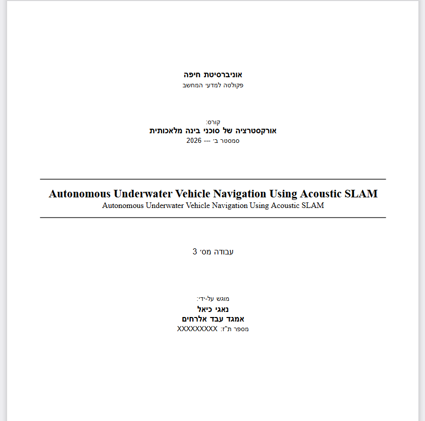
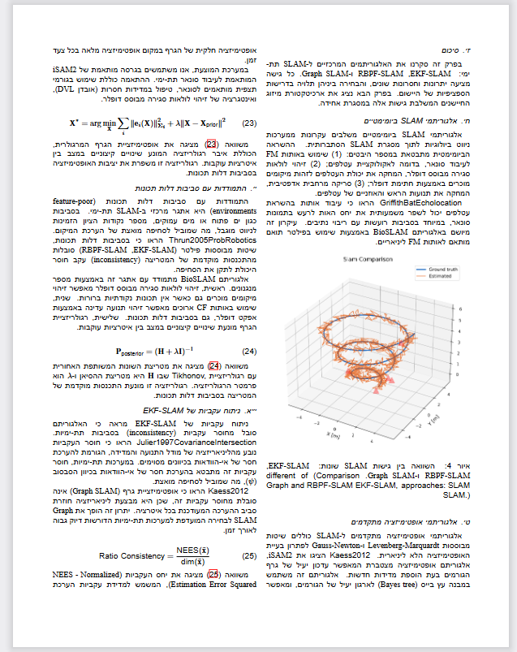
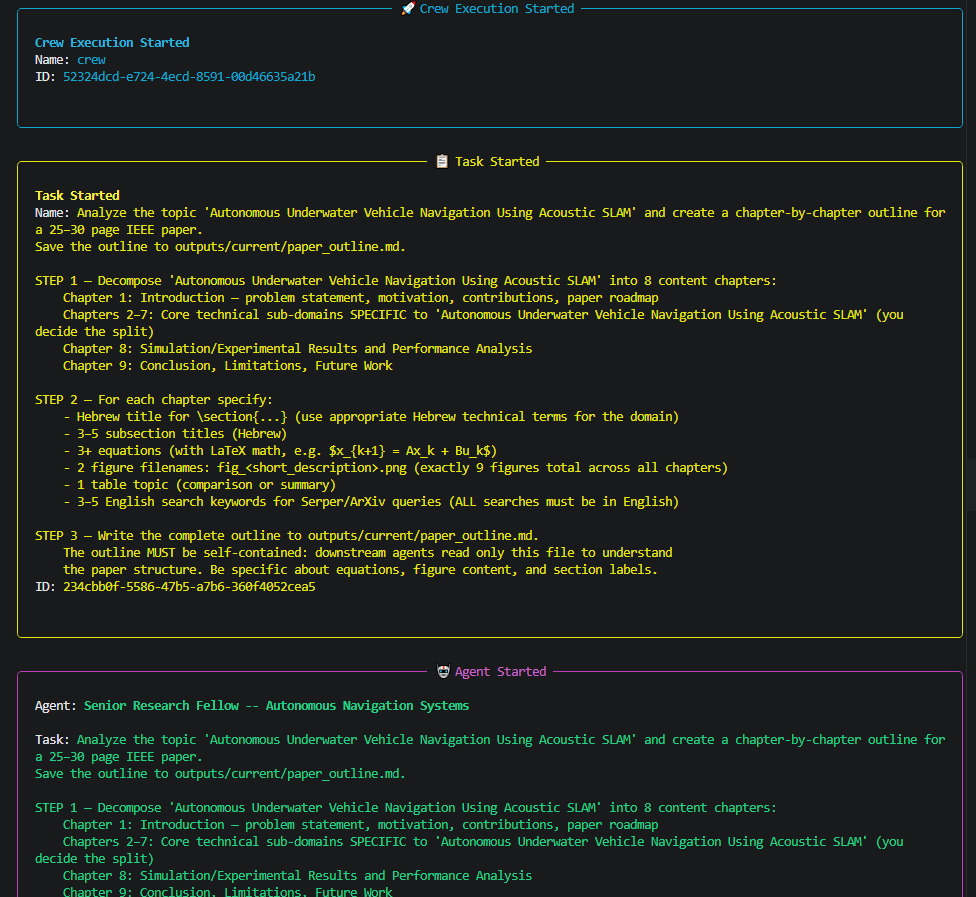
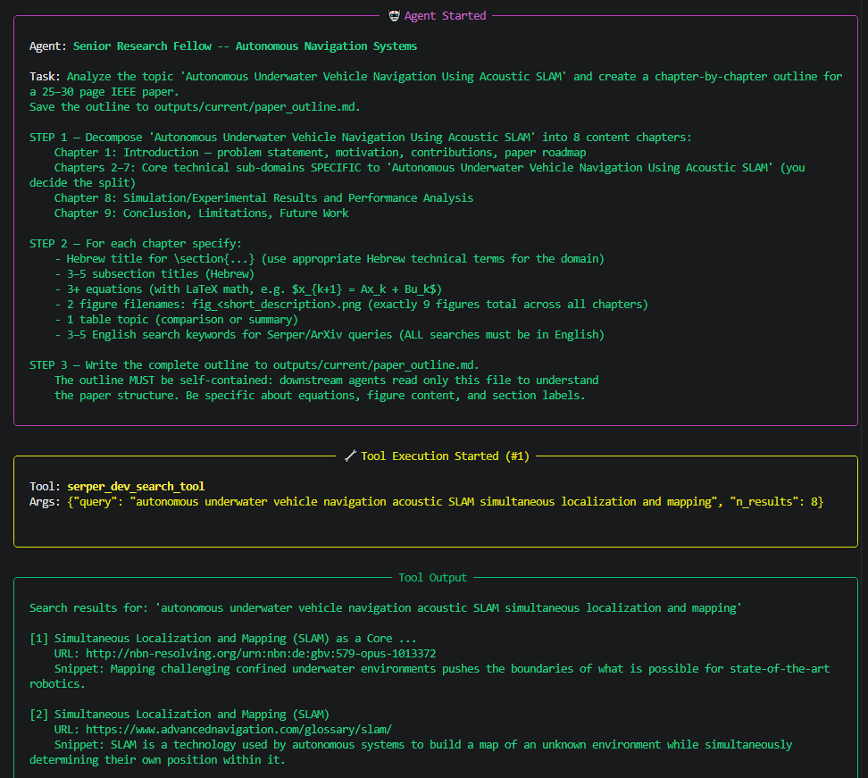
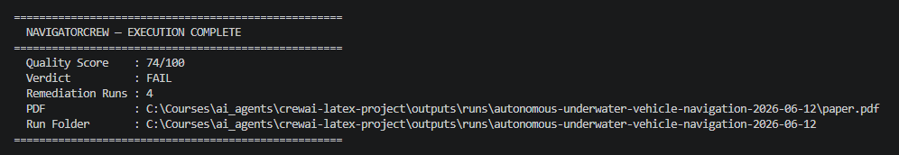
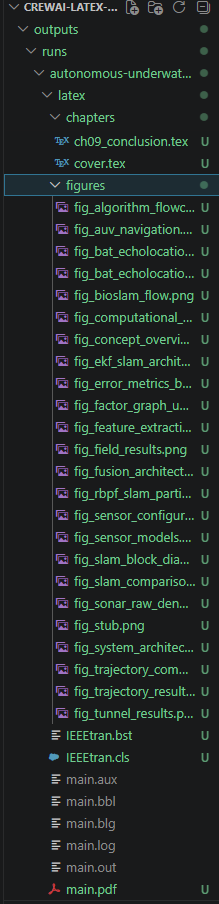
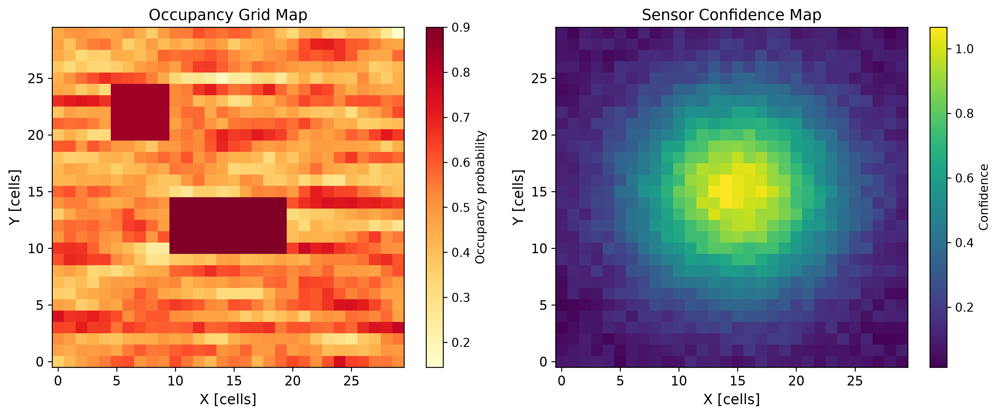
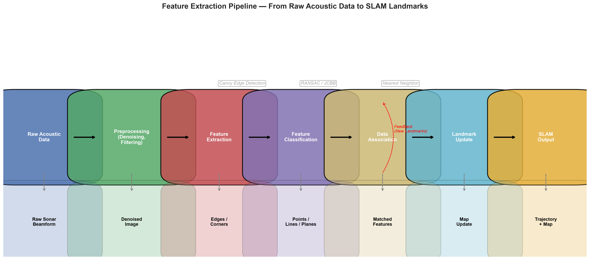
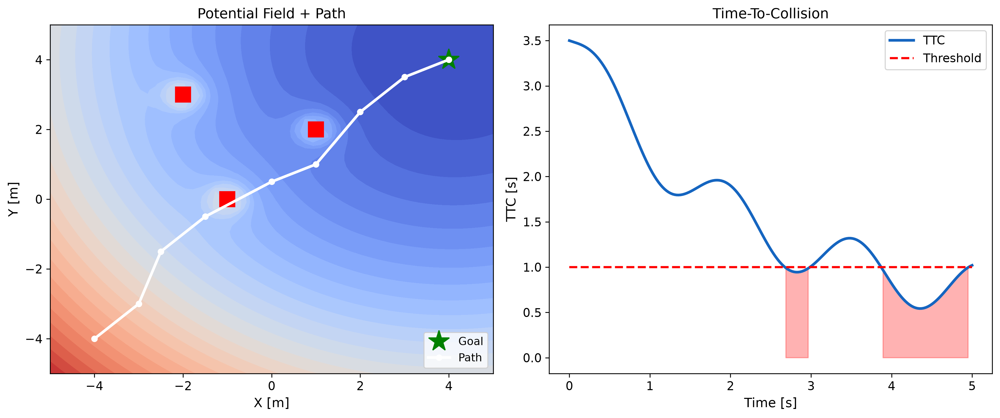

# NavigatorCrew

An autonomous multi-agent research platform that takes a `--topic` argument and produces a complete, compiled IEEE-formatted academic paper in XeLaTeX (Hebrew/English bilingual).

Built for Assignment 3 — *Orchestration of AI Agents*, Semester B 2026.

---

## Demo

A full run takes a single `--topic` argument and produces a compiled, bilingual IEEE paper end to end.


### Compiled paper

| Cover page | Content + figure |
|:---:|:---:|
|  |  |

### Pipeline run







### Generated output




### Sample generated figures

| Figure 1 | Figure 2 | Figure 3 |
|:---:|:---:|:---:|
|  |  |  |

### Latest Results

| Run | Topic | Score | PDF | Remediation |
|---|---|---|---|---|
| bat-inspired-2026-06-11-v2 | Bat-Inspired Drone Navigation via Bio-Mimetic Sonar | 96/100 (PASS) | 4.1 MB | 0 cycles |
| pit-viper-inspired-2026-06-11 | Pit Viper Inspired Infrared Thermal and Acoustic Navigation | 90/100 (PASS) | 5.3 MB | 1 cycle |
| swarm-intelligence-2026-06-11 | Swarm Intelligence Based Search and Rescue | 76/100 | 3.6 MB | 2 cycles |

---

## Architecture

```
main.py --topic "..."
        |
        v
+-----------------------------------------------+
|           LangGraph State Machine              |
|                                                |
|  [run_research_phase]        10 agents         |
|         |                                      |
|         v                                      |
|  [validate_and_fix_research] programmatic      |
|         |                                      |
|         v                                      |
|  [run_writing_phase]         5 agents          |
|         |                                      |
|         v                                      |
|  [run_quality_gate] --PASS--> [END]            |
|         |                                      |
|        FAIL                                    |
|         v                                      |
|  [run_remediation] ---------> [run_quality_gate]
|         (max 4 cycles)                         |
+-----------------------------------------------+
        |
        v

  Phase 1: Research Crew (sequential, 10 agents)
  +----------------------------------------------------+
  |   1. NavigationDirector     -> paper_outline.md     |
  |   2. SLAMResearcher         -> research_briefs.md   |
  |   3. VisionAIExpert         -> domain_vision_ai.md  |
  |   4. PhysicsExpert          -> domain_physics.md    |
  |   5. AlgorithmsExpert       -> domain_algorithms.md |
  |   6. AerospaceMarineExpert  -> domain_aerospace.md  |
  |   7. BiologyExpert          -> domain_biology.md    |
  |   8. SignalProcessingExpert -> domain_signal_proc.md|
  |   9. ControlSystemsExpert   -> domain_control.md    |
  |  10. MLExpert               -> domain_ml.md         |
  +----------------------------------------------------+

  Validation: check output sizes, detect stuck agents, re-run failures

  Phase 2: Writing Crew (sequential, 5 agents)
  +----------------------------------------------------+
  |   1. VisualizationEngineer  -> PNG figures          |
  |   2. HebrewAcademicWriter   -> hebrew_prose.md      |
  |   3. LaTeX Writer A         -> abstract+ch01-03+bib |
  |   4. LaTeX Writer B         -> ch04-06              |
  |   5. LaTeX Writer C         -> ch07-09              |
  +----------------------------------------------------+

  Programmatic quality gate (no LLM, deterministic)
        |
        v
  XeLaTeX compiler (xelatex -> bibtex -> xelatex x 3)
        |
        v
  outputs/runs/{slug}-{date}/paper.pdf
```

### Key Design Decisions

| Feature | Implementation |
|---|---|
| **Split pipeline** | Research and writing run as separate CrewAI crews with validation between them |
| **Language separation** | Research in English -> HebrewAcademicWriter -> 3 LaTeX writers (pure formatters) |
| **8 domain experts** | PhD-level specialists contribute equations, algorithms, references in their field |
| **3 LaTeX writers** | A (abstract+ch01-03+bib), B (ch04-06), C (ch07-09) for better iteration budget |
| **Quality gate** | Programmatic checker in LangGraph node; no LLM, no loop risk |
| **Feedback loop** | LangGraph conditional edge: score < 90 -> remediation (max 4 cycles) |
| **25-fix sanitizer** | Auto-fixes common LLM errors (em dashes, `\begin{center}`, `\ensuremath`, stray braces, figure sizing, etc.) before compilation |
| **Fault tolerance** | Every task writes an `output_file`; `--resume` skips completed tasks |
| **Run isolation** | `outputs/runs/{slug}-{date}/` is self-contained; project-root `latex/` is read-only template |
| **Cost** | DeepSeek V3 via OpenAI-compatible API (~$0.22/run base, ~$0.29 typical with remediation) |
| **Bilingual LaTeX** | XeLaTeX + polyglossia + bidi; `\en{}` wraps all English in Hebrew prose |

---

## Setup

### 1. Prerequisites

- Python 3.11+
- XeLaTeX: `sudo apt install texlive-xetex texlive-lang-other`

### 2. Install

Using [uv](https://docs.astral.sh/uv/) (recommended — reproducible from `uv.lock`):

```bash
git clone <repo-url>
cd <project-dir>
uv sync                 # creates .venv and installs the locked dependency set
uv sync --extra dev     # add this to also install pytest + ruff for development
```

Or with pip:

```bash
git clone <repo-url>
cd <project-dir>
python -m venv venv && source venv/bin/activate
pip install -r requirements.txt
```

### 3. Configure API Keys

```bash
cp .env.example .env
# Edit .env with your keys
```

```env
DEEPSEEK_API_KEY=sk-...     # platform.deepseek.com
ACTIVE_PROVIDER=deepseek
SERPER_API_KEY=...          # free at serper.dev
```

### 4. Install bidi (first time only)

```bash
tlmgr init-usertree
tlmgr --repository http://ftp.math.utah.edu/pub/tex/historic/systems/texlive/2023/tlnet-final install bidi
```

Register Windows fonts with fontconfig (WSL only):

```bash
mkdir -p ~/.config/fontconfig
cat > ~/.config/fontconfig/fonts.conf << 'EOF'
<?xml version="1.0"?>
<!DOCTYPE fontconfig SYSTEM "fonts.dtd">
<fontconfig>
  <dir>/mnt/c/Windows/Fonts</dir>
</fontconfig>
EOF
fc-cache -f ~/.config/fontconfig
```

---

## Usage

### Running with uv (recommended)

```bash
uv run python main.py --topic "Your Topic Here"
uv run python main.py --dry-run          # verify pipeline without LLM calls
uv run python -m pytest tests/ -v        # run tests
uv run ruff check src/ tests/ main.py    # lint
```

`uv run` automatically uses the locked `.venv` created by `uv sync`. The `.venv/bin/python` interpreter and all dependencies are managed by uv.

### Running with venv

```bash
source venv/bin/activate

# Full run (split pipeline, 13 agents) — default topic
python3 main.py

# Custom topic
python3 main.py --topic "Autonomous Underwater Vehicle Navigation Using Acoustic SLAM"

# Speed modes
python3 main.py --fast       # 5 agents, skip domain experts, ~20-40 min
python3 main.py --smoke      # 2 agents, outline + latex only, ~10-20 min
python3 main.py --dry-run    # 0 LLM calls, stub content, ~5-30 sec

# Utility flags
python3 main.py --resume     # Skip tasks with existing output files
python3 main.py --no-pdf     # Content only, no PDF compilation
python3 main.py --no-archive # Skip run archiving
```

### Speed Modes

| Flag | Agents | Pipeline | Est. Time | Use case |
|---|---|---|---|---|
| (none) | 13 | Split: research -> validate -> writing | 60-120 min | Production runs |
| `--fast` | 5 | Single crew, skip domain experts | 20-40 min | Dev iteration |
| `--smoke` | 2 | Single crew, outline + latex only | 10-20 min | Quick structural test |
| `--dry-run` | 0 | Stub generators, no LLM | 5-30 sec | PDF pipeline verification |

### Output Layout

Each run is self-contained. The project-root `latex/` is a **read-only template** never modified during a run:

```
outputs/runs/
 └── bat-inspired-drone-navigation-2026-06-10/
     ├── latex/
     │   ├── main.tex               <- PROTECTED
     │   ├── chapters/              <- cover.tex (static) + 10 agent-written .tex
     │   ├── figures/               <- agent-generated PNG figures (300 DPI)
     │   ├── references.bib         <- 14+ BibTeX entries (agent-written)
     │   └── IEEEtran.cls / .bst
     ├── outputs/                   <- agent .md reports
     │   ├── paper_outline.md
     │   ├── research_briefs.md
     │   ├── domain_*.md            <- 8 domain expert contributions
     │   ├── hebrew_prose.md
     │   ├── figures_manifest.md
     │   ├── latex_status_a/b/c.md
     │   └── quality_report.md
     ├── paper.pdf                  <- compiled IEEE paper
     └── run_manifest.txt
```

---

## Agents

### Research Phase (10 agents)

| Agent | Max Iter | Tools | Role |
|---|---|---|---|
| NavigationDirector | 12 | FileReader, FileWriter, Serper, ArXiv | Decomposes topic into 9-chapter outline |
| SLAMResearcher | 18 | FileReader, Serper, ArXiv, WebScraper | English-language literature research |
| VisionAIExpert | 15 | FileReader, FileWriter, Serper, ArXiv | Visual SLAM, depth estimation, semantic perception |
| PhysicsExpert | 15 | FileReader, FileWriter, Serper, ArXiv | Acoustics, matched filter, Doppler, wave propagation |
| AlgorithmsExpert | 15 | FileReader, FileWriter, Serper, ArXiv | EKF/UKF/particle filters, factor graph SLAM |
| AerospaceMarineExpert | 15 | FileReader, FileWriter, Serper, ArXiv | UAV dynamics, INS, AUV/submarine sonar |
| BiologyExpert | 15 | FileReader, FileWriter, Serper, ArXiv | Bat echolocation, DSC, biosonar |
| SignalProcessingExpert | 15 | FileReader, FileWriter, Serper, ArXiv | Chirp analysis, beamforming, matched filtering |
| ControlSystemsExpert | 15 | FileReader, FileWriter, Serper, ArXiv | UAV control, PID/LQR, path planning |
| MLExpert | 15 | FileReader, FileWriter, Serper, ArXiv | Neural architectures, fusion networks, RL navigation |

### Writing Phase (5 agents)

| Agent | Max Iter | Tools | Role |
|---|---|---|---|
| VisualizationEngineer | 40 | CodeExecutor, FileWriter, FileReader | IEEE-standard PNG figures via matplotlib |
| HebrewAcademicWriter | 40 | FileReader, FileWriter | English research -> Hebrew academic prose (1500-2500 words/chapter) |
| LaTeX Writer A | 30 | FileWriter, FileReader | abstract + ch01-03 + references.bib |
| LaTeX Writer B | 30 | FileWriter, FileReader | ch04-06 (core technical chapters) |
| LaTeX Writer C | 30 | FileWriter, FileReader | ch07-09 (system, results, conclusion) |

All agents use DeepSeek V3 (`openai/deepseek-chat`).

**Domain experts** each independently read the research briefs and contribute PhD-level content in their specialty area.

### Quality Gate

Programmatic (no LLM). Per-chapter checks:

| Check | Default threshold | Relaxed for |
|---|---|---|
| Word count | >= 1400 | abstract (80), ch09 (700), ch06/ch08 (1800), ch07 (1600) |
| Equations | >= 2 | abstract (0), ch01 (1), ch09 (0) |
| Figures | >= 1 | abstract (0), ch01 (0), ch09 (0) |
| Subsections | >= 3 | abstract (0), ch09 (2), ch06/ch08 (5), ch07 (4) |
| Citations | >= 2 | abstract (0), ch09 (1), ch06/ch08 (3) |

Additional checks: `references.bib` >= 10 entries, missing figure penalty (capped at -20), no `\begin{center}` at document level, no em dashes in Hebrew prose, no placeholder `\fbox` boxes.

Score < 90 -> FAIL -> remediation crew (max 4 cycles).

---

## Project Structure

```
.
├── main.py                    <- entry point; sanitizer; PDF compilation; finalize
├── requirements.txt
├── .env / .env.example
├── src/
│   ├── config.py              <- LLM init, PROTECTED_FILES, AGENT_MAX_ITER, logging
│   ├── crew.py                <- CrewAI assembly (research crew + writing crew)
│   ├── stubs.py               <- dry-run stub generators
│   ├── agents/                <- factory function per agent (13 files)
│   │   ├── navigation_director.py
│   │   ├── slam_researcher.py
│   │   ├── vision_ai_expert.py
│   │   ├── physics_expert.py
│   │   ├── algorithms_expert.py
│   │   ├── aerospace_marine_expert.py
│   │   ├── biology_expert.py
│   │   ├── signal_processing_expert.py
│   │   ├── control_systems_expert.py
│   │   ├── ml_expert.py
│   │   ├── visualization_engineer.py
│   │   ├── hebrew_academic_writer.py
│   │   └── latex_author.py
│   ├── tasks/                 <- task factories (outline/research/domain/figures/prose/latex A+B+C)
│   ├── tools/                 <- ArXiv, Serper, WebScraper, SafeFileWriter, CodeExecutor, FileReader
│   ├── graph/                 <- LangGraph state machine (state.py, nodes.py, navigator_graph.py)
│   └── utils/                 <- TokenAccountant
├── latex/                     <- READ-ONLY TEMPLATE (never modified during runs)
│   ├── main.tex               <- PROTECTED master document
│   ├── chapters/              <- cover.tex only (all content chapters are agent-written)
│   ├── references.bib         <- seed bibliography
│   └── IEEEtran.cls / .bst
├── outputs/
│   └── runs/                  <- per-run archives (gitignored)
├── tests/                     <- test suite (agents, tasks, quality gate, config, latex sources)
├── docs/                      <- PRD.md, PLAN.md, TODO.md, ISSUES.md, BUDGET.md
└── homework/                  <- assignment requirements and course materials
```

---

## Content Pipeline

The content flows through three stages with explicit handoffs:

1. **Research (English)**: Director creates outline -> Researcher writes briefs -> 8 domain experts contribute depth
2. **Validation**: Programmatic check of all research outputs; fixer crew re-runs any that failed
3. **Writing (Hebrew)**: Hebrew writer produces prose -> 3 LaTeX writers format into XeLaTeX chapters

Word count targets ensure 25-30 printed pages:

| Stage | ch01 | ch02-05 | ch06/ch08 | ch07 | ch09 |
|---|---|---|---|---|---|
| Hebrew prose | 1500 | 2000 | 2500 | 2000 | 1200 |
| LaTeX task target | 2500 | 3200 | 4000 | 3200 | 2000 |
| Quality gate min | 1400 | 1400 | 1800 | 1600 | 700 |

### LaTeX Sanitizer

Before compilation, `_sanitize_tex_files()` applies 25 automatic fixes to agent-generated LaTeX:
- Removes preamble commands from chapter files (`\documentclass`, `\usepackage`, `\begin{document}`)
- Replaces `\begin{center}` with `\centering` (prevents bidi crash)
- Replaces em dashes with colons, en dashes with hyphens
- Wraps `lstlisting` in `\begin{english}` for LTR rendering
- Replaces `[H]` float placement with `[htbp]` (prevents overlap in two-column)
- Wraps `tabular` in `\adjustbox` (prevents column overflow)
- Escapes bare `%` in running text (prevents comment-swallowing)
- Converts `algorithm`/`algorithmic` environments to `lstlisting`
- Replaces `\degree` with Unicode degree sign (prevents undefined control sequence)
- Wraps bare math symbols in `$...$` (prevents "Missing $ inserted" errors)
- Repairs truncated files with unbalanced braces (Fix 20)
- Converts author-name commands `\Au`, `\Thorp` -> `\en{Au}` (Fix 21)
- Resolves `\ensuremath{$\theta$}` nested math mode (Fix 22, brace-counting parser)
- Removes stray `}` via brace-depth tracking (Fix 23)
- Auto-upgrades wide figures to `figure*` (two-column) based on PNG aspect ratio (Fix 24)
- Extracts math superscripts from `\en{}` blocks: `\en{m/s^2}` -> `\en{m/s}$^2$` (Fix 25)

---

## Testing

```bash
source venv/bin/activate
python3 -m pytest tests/ -v
```

Test suite (288 tests, 91% line coverage): agent instantiation and properties, task creation, crew assembly, quality gate scoring (pass/fail/edge cases), config validation, LaTeX source invariants, run-folder structure, token accounting, the LangGraph nodes, the dry-run/compile path, tool security and network tools (code executor, file writer, file reader, Serper, ArXiv, web scraper).

Run with coverage:

```bash
python3 -m pytest --cov=src --cov=main --cov-report=term-missing
```

---

## Budget

| Component | Est. Cost |
|-----------|-----------|
| Per run (DeepSeek V3, with remediation) | ~$0.29 |
| Total pipeline runs (~40 runs during development) | ~$4.80 |
| Development tooling (Claude, code assistance) | ~$8.00 |
| **Grand total** | **~$12.80** |

See [docs/BUDGET.md](docs/BUDGET.md) for full token breakdown.
